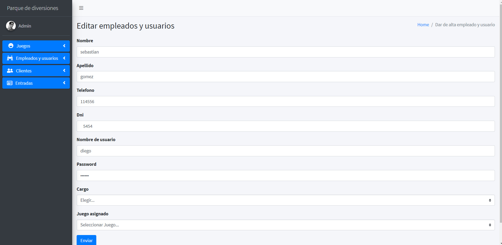
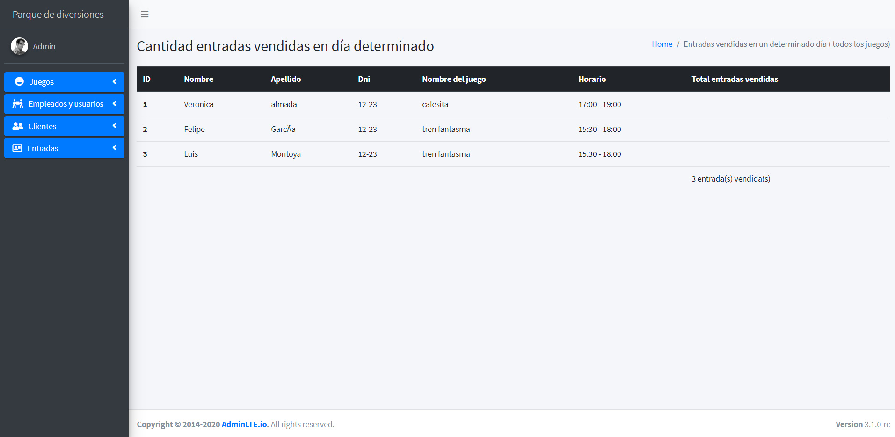
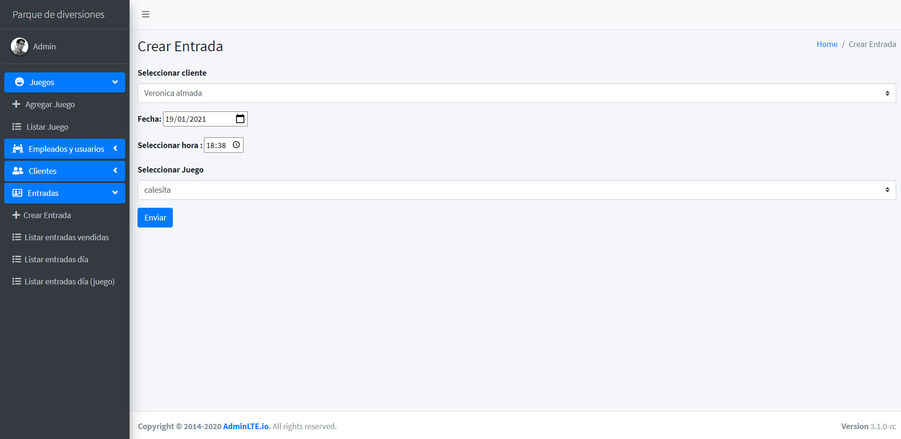

 Código trabajo práctico final del curso  desarrollador web fullstack con Java Polotic 2020
 
consigna del tp , UML, especificación configuración base de datos: https://drive.google.com/drive/folders/1sIgsbnRZ03i3lxAjLy5ejPUa2icURscq

video demo  y explicación  del proyecto andando : https://vimeo.com/493136428

